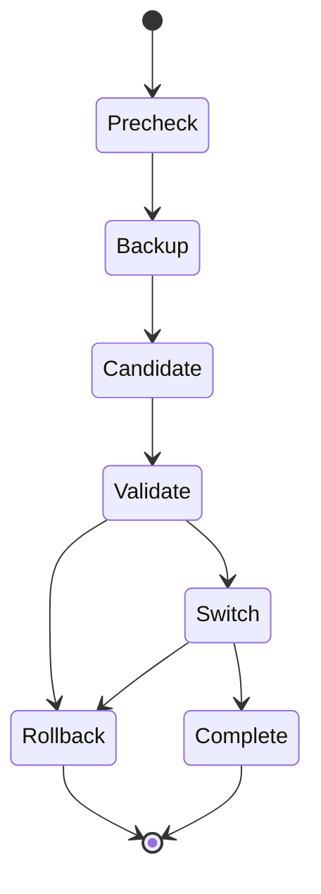

# State Machines

## Update (simplified)



## Quarantine

```text
CREATED → SCANNING → REVIEW|FAILED|APPROVED_FOR_STAGE → APPROVED_FOR_PRODUCTION
                 ↘ REJECTED
```

## Stage retention

```text
created_at immutable → active countdown → Needs Action → final backup → Safe Shield delete
```

## Migration

Discovery → Pair → Readiness → Domain/TLS → Transfer → Auth/Rebind → Cutover → Stabilize → Archive (no auto purge)
